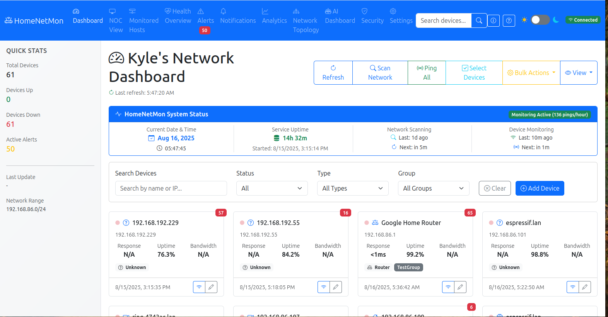
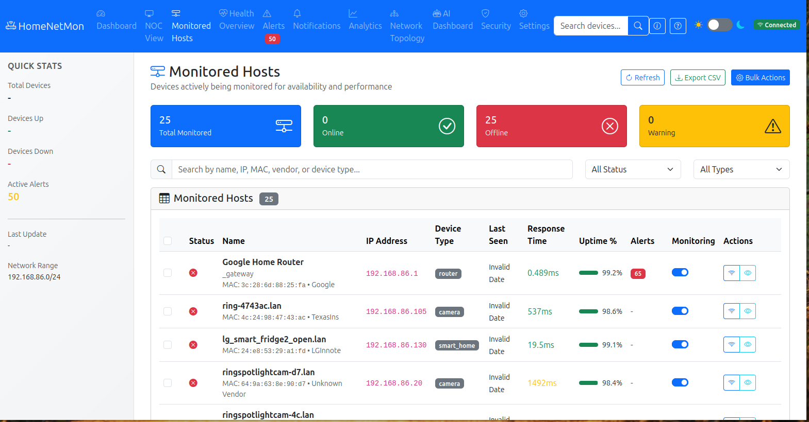
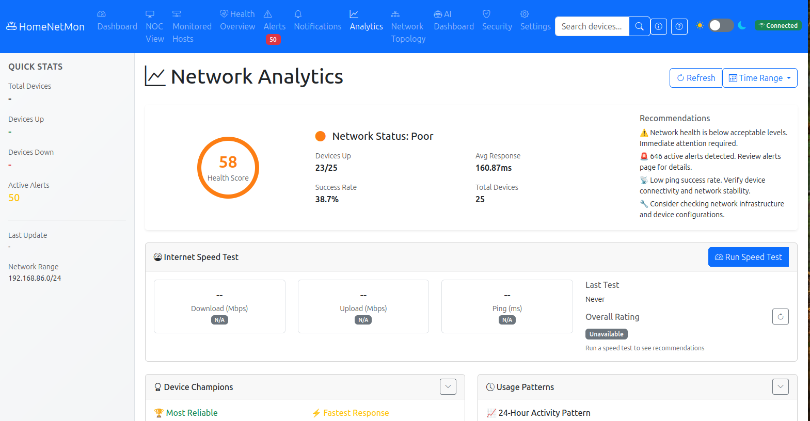
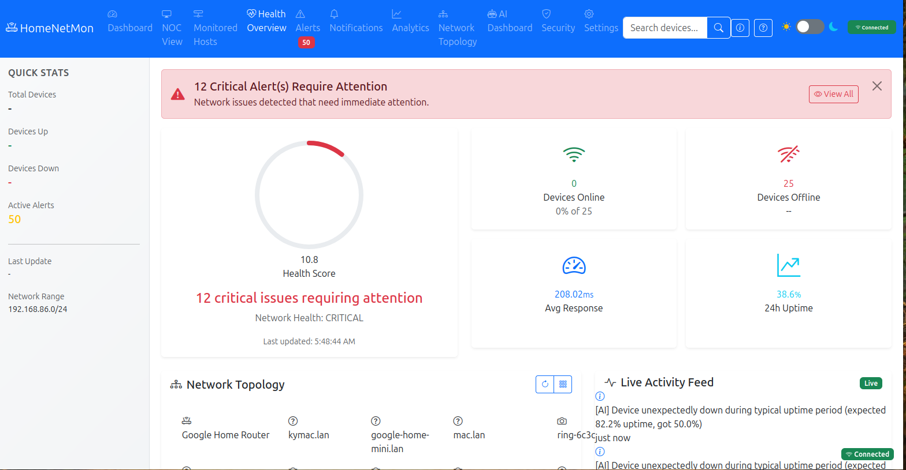
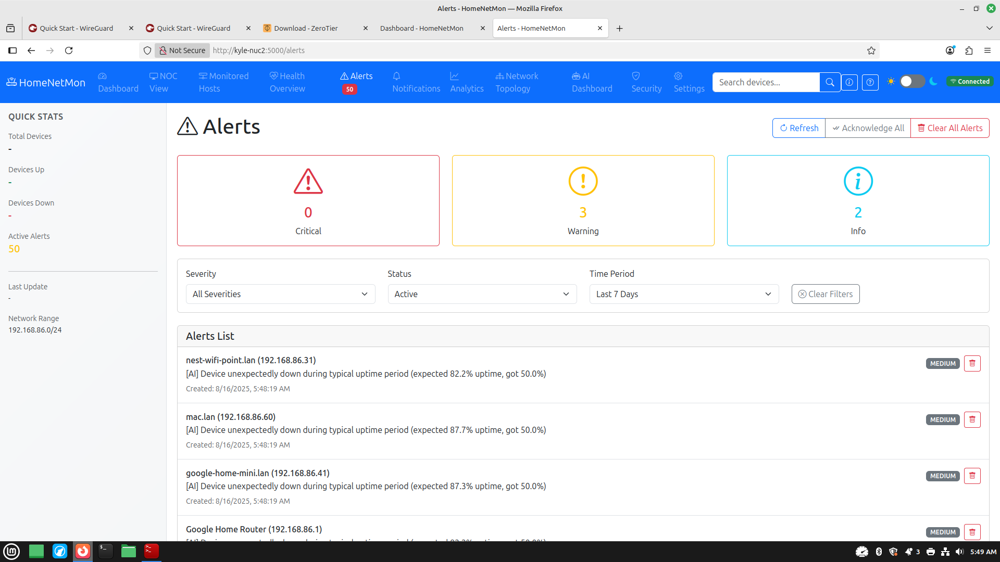

# HomeNetMon - Home Network Monitoring Solution

A comprehensive, self-hosted network monitoring solution designed for home networks. Monitor device availability, track performance metrics, receive alerts, and gain insights into your network's health through an intuitive web dashboard.

## Screenshots

### 🏠 Main Dashboard

*Real-time device monitoring with status grid and network overview*

### 📊 Monitored Hosts

*Comprehensive device management with MAC addresses, vendor information, and bulk operations*

### 📈 Analytics Dashboard  

*Network performance analytics, health scores, and usage insights*

### 🏥 Health Overview

*Network health monitoring with real-time metrics and performance trends*

### 🚨 Alert Management

*Active alert monitoring, notifications, and alert history management*

## Features

### 🔍 **Network Discovery & Device Management**
- Automatic device discovery using ARP table parsing and nmap scanning
- Device type classification (router, computer, phone, IoT, etc.)
- MAC address vendor lookup
- Custom device naming and grouping
- Persistent device information storage

### 📊 **Real-time Monitoring**
- Continuous ping monitoring with configurable intervals
- Response time tracking and statistics
- Device availability status (up/down/warning/unknown)
- Historical data collection and analysis
- Performance trend visualization

### 🌐 **Web Dashboard**
- Modern, responsive web interface
- Real-time status updates via WebSockets
- Interactive device grid and list views
- Individual device detail pages with graphs
- Network topology visualization
- Mobile-friendly design

### 🔔 **Alerting System**
- Configurable alert rules (device down, high latency)
- Multiple notification methods:
  - Email notifications via SMTP
  - Webhook integrations
  - In-dashboard notifications
- Alert acknowledgment and management
- Escalation policies for critical devices

### ⚙️ **Configuration & Management**
- Web-based configuration interface
- YAML configuration file support
- Environment variable overrides
- Data retention policies
- Export capabilities (CSV)

## Quick Start

### Manual Installation (Recommended for Development)

The fastest way to get HomeNetMon running:

1. **Install system dependencies:**
   ```bash
   # Ubuntu/Debian
   sudo apt update
   sudo apt install -y python3 python3-pip python3-venv nmap
   ```

2. **Clone and setup:**
   ```bash
   git clone https://github.com/ShaKy8/HomeNetMon.git
   cd HomeNetMon
   
   # Create virtual environment
   python3 -m venv venv
   source venv/bin/activate
   
   # Install dependencies
   pip install --upgrade pip
   pip install -r requirements.txt
   ```

3. **Configure:**
   ```bash
   cp .env.example .env
   # Edit NETWORK_RANGE in .env to match your network (e.g., 192.168.1.0/24)
   nano .env
   ```

4. **Start HomeNetMon:**
   ```bash
   python app.py
   ```

5. **Access dashboard:** http://localhost:5000

### Docker Deployment 

1. **Clone and start:**
   ```bash
   git clone https://github.com/ShaKy8/HomeNetMon.git
   cd HomeNetMon
   cp .env.example .env
   # Edit .env with your settings
   docker-compose up -d
   ```

2. **Access dashboard:** http://localhost:5000

### Production Installation (Ubuntu/Debian)

1. **Run the automated installer:**
   ```bash
   sudo ./install.sh
   ```

2. **Access dashboard:** http://your-server-ip:5000

## Installation Methods

### Option 1: Docker (Recommended)

Docker provides the easiest deployment method with all dependencies included.

**Prerequisites:**
- Docker Engine 20.10+
- Docker Compose v2.0+

**Step-by-step:**

1. **Clone and prepare:**
   ```bash
   git clone <repository-url>
   cd HomeNetMon
   mkdir -p data config
   ```

2. **Configure environment variables:**
   ```bash
   cat > .env << EOF
   # Network Configuration
   NETWORK_RANGE=192.168.1.0/24
   PING_INTERVAL=30
   SCAN_INTERVAL=300
   
   # Email Alerts (Optional)
   SMTP_SERVER=smtp.gmail.com
   SMTP_PORT=587
   SMTP_USERNAME=your-email@gmail.com
   SMTP_PASSWORD=your-app-password
   ALERT_FROM_EMAIL=your-email@gmail.com
   ALERT_TO_EMAILS=admin@yourdomain.com
   
   # Security
   SECRET_KEY=your-super-secret-key-here
   EOF
   ```

3. **Start services:**
   ```bash
   docker-compose up -d
   ```

4. **Verify installation:**
   ```bash
   curl http://localhost:5000/health
   ```

### Option 2: Native Installation

For Ubuntu/Debian systems, use the automated installation script.

**Prerequisites:**
- Ubuntu 18.04+ or Debian 10+
- Sudo privileges
- Internet connection

**Installation:**
```bash
# Make script executable
chmod +x install.sh

# Run installation
sudo ./install.sh

# Check service status
sudo systemctl status homeNetMon
```

**Manual Installation:**

If you prefer manual installation or are using a different OS:

1. **Install system dependencies:**
   ```bash
   # Ubuntu/Debian
   sudo apt update
   sudo apt install -y python3 python3-pip python3-venv nmap iputils-ping net-tools
   
   # CentOS/RHEL  
   sudo yum install python3 python3-pip python3-venv nmap iputils net-tools
   
   # Arch Linux
   sudo pacman -S python python-pip nmap iputils net-tools
   ```

2. **Clone the repository:**
   ```bash
   git clone https://github.com/ShaKy8/HomeNetMon.git
   cd HomeNetMon
   ```

3. **Create and activate virtual environment:**
   ```bash
   python3 -m venv venv
   source venv/bin/activate
   ```

4. **Install Python dependencies:**
   ```bash
   pip install --upgrade pip
   pip install -r requirements.txt
   ```

5. **Create configuration file:**
   ```bash
   cp .env.example .env
   # Edit .env with your network settings
   nano .env
   ```
   Update at minimum:
   - `NETWORK_RANGE=192.168.1.0/24` (change to match your network)
   - `DEBUG=true` (for development)

6. **Start HomeNetMon:**
   ```bash
   python app.py
   ```

7. **Access the dashboard:**
   Open http://localhost:5000 in your browser

**To stop HomeNetMon:**
```bash
# Find the process ID
ps aux | grep "python app.py"
# Kill the process
pkill -f "python app.py"
```

## Configuration

### Environment Variables

| Variable | Default | Description |
|----------|---------|-------------|
| `NETWORK_RANGE` | `192.168.86.0/24` | Network range to monitor (CIDR notation) |
| `PING_INTERVAL` | `30` | Seconds between ping checks |
| `SCAN_INTERVAL` | `300` | Seconds between network scans |
| `PING_TIMEOUT` | `3.0` | Ping timeout in seconds |
| `MAX_WORKERS` | `50` | Maximum concurrent monitoring threads |
| `HOST` | `0.0.0.0` | Web server bind address |
| `PORT` | `5000` | Web server port |
| `DEBUG` | `false` | Enable debug mode |
| `DATA_RETENTION_DAYS` | `30` | Days to keep monitoring data |

### Email Configuration

| Variable | Description |
|----------|-------------|
| `SMTP_SERVER` | SMTP server hostname |
| `SMTP_PORT` | SMTP server port (usually 587) |
| `SMTP_USERNAME` | SMTP authentication username |
| `SMTP_PASSWORD` | SMTP authentication password |
| `SMTP_USE_TLS` | Enable TLS encryption (true/false) |
| `ALERT_FROM_EMAIL` | From address for alert emails |
| `ALERT_TO_EMAILS` | Comma-separated recipient addresses |

### Webhook Configuration

| Variable | Description |
|----------|-------------|
| `WEBHOOK_URL` | URL to POST alert notifications |
| `WEBHOOK_TIMEOUT` | Webhook request timeout in seconds |

### Configuration File

You can also use a YAML configuration file (`config.yaml`):

```yaml
network:
  range: "192.168.1.0/24"
  ping_interval: 30
  scan_interval: 300
  ping_timeout: 3.0
  max_workers: 50

alerts:
  email:
    enabled: true
    smtp_server: "smtp.gmail.com"
    smtp_port: 587
    username: "your-email@gmail.com"
    password: "your-password"
    use_tls: true
    from_email: "alerts@yourdomain.com"
    to_emails:
      - "admin@yourdomain.com"
      - "user@yourdomain.com"
  
  webhook:
    enabled: true
    url: "https://your-webhook-url.com/alerts"
    timeout: 10

database:
  retention_days: 30

logging:
  level: "INFO"
```

## Usage Guide

### Initial Setup

1. **Access the dashboard** at `http://your-server:5000`
2. **Configure network range** in Settings → Network
3. **Set up alerts** in Settings → Alerts
4. **Wait for initial scan** to discover devices (may take a few minutes)

### Managing Devices

**Add Device Manually:**
- Click "Add Device" on dashboard
- Enter IP address and optional details
- Choose whether to monitor the device

**Edit Device:**
- Click device card or use edit button
- Modify name, type, group, or monitoring status
- Save changes

**Device Groups:**
- Organize devices into logical groups
- Filter dashboard by group
- Useful for different network segments

### Monitoring Features

**Dashboard Views:**
- **Grid View:** Visual cards showing device status
- **List View:** Tabular view with detailed information
- **Filters:** Search by name, IP, status, type, or group

**Device Details:**
- Response time charts (1H, 6H, 24H, 7D)
- Uptime statistics
- Historical monitoring data
- Recent alerts

**Real-time Updates:**
- Status changes appear immediately
- Live response time monitoring
- Automatic refresh every 30 seconds

### Alert Management

**Alert Types:**
- **Device Down:** Device doesn't respond to ping
- **High Latency:** Response time exceeds threshold
- **Custom:** Additional alerts can be configured

**Alert Actions:**
- **Acknowledge:** Mark alert as seen
- **Resolve:** Mark alert as fixed
- **Auto-resolve:** Alerts resolve when conditions improve

## API Documentation

HomeNetMon provides a REST API for integration with other systems.

### Authentication

Currently, no authentication is required for API access. This is suitable for home networks but consider adding authentication for production use.

### Endpoints

#### Devices

**Get All Devices**
```http
GET /api/devices
```

**Get Specific Device**
```http
GET /api/devices/{id}
```

**Create Device**
```http
POST /api/devices
Content-Type: application/json

{
  "ip_address": "192.168.1.100",
  "custom_name": "My Device",
  "device_type": "computer",
  "device_group": "main",
  "is_monitored": true
}
```

**Update Device**
```http
PUT /api/devices/{id}
Content-Type: application/json

{
  "custom_name": "Updated Name",
  "is_monitored": false
}
```

**Delete Device**
```http
DELETE /api/devices/{id}
```

**Ping Device**
```http
POST /api/devices/{id}/ping
```

#### Monitoring Data

**Get Monitoring Timeline**
```http
GET /api/monitoring/timeline?device_id=1&hours=24&interval=hour
```

**Get Statistics**
```http
GET /api/monitoring/statistics?device_id=1&hours=24
```

**Export Data**
```http
GET /api/monitoring/export?device_id=1&hours=168
```

#### Alerts

**Get Alerts**
```http
GET /api/monitoring/alerts?severity=critical&resolved=false
```

**Acknowledge Alert**
```http
POST /api/monitoring/alerts/{id}/acknowledge
```

**Resolve Alert**
```http
POST /api/monitoring/alerts/{id}/resolve
```

#### Configuration

**Get Configuration**
```http
GET /api/config
```

**Update Network Config**
```http
PUT /api/config/network
Content-Type: application/json

{
  "network_range": "192.168.1.0/24",
  "ping_interval": 30,
  "scan_interval": 300
}
```

## Troubleshooting

### Common Issues

**1. Installation Issues**

*Problem: "ModuleNotFoundError: No module named 'pip'"*
```bash
# Solution: Install pip for your system
sudo apt install python3-pip python3-venv  # Ubuntu/Debian
```

*Problem: "externally-managed-environment" error*
```bash
# This is expected on newer Python versions
# Solution: Always use virtual environments (already in our instructions)
python3 -m venv venv
source venv/bin/activate
pip install -r requirements.txt
```

*Problem: "ModuleNotFoundError: No module named 'numpy'"*
```bash
# Solution: The requirements.txt now includes all needed packages
# Make sure you're in the virtual environment and run:
pip install -r requirements.txt
```

**2. Network Discovery Issues**

*Problem: No devices discovered*
- Check network range configuration in `.env`: `NETWORK_RANGE=192.168.1.0/24`
- Verify HomeNetMon can access the network
- Ensure nmap is installed: `which nmap`
- Check firewall settings
- Try manual nmap scan: `nmap -sn 192.168.1.0/24`

*Problem: nmap errors in logs*
- Verify nmap installation: `nmap --version`
- Check network permissions
- Try running as sudo for testing: `sudo python app.py`

**3. Permission Issues**

*Problem: Permission errors for ping operations*
- For development: Run `./fix_ping_permissions.sh` (requires sudo)
- For production: Use the systemd service which handles permissions
- Alternative: Run with sudo (not recommended for production)

**4. Application Startup Issues**

*Problem: "Address already in use" error*
```bash
# Solution: Kill existing process or change port
pkill -f "python app.py"
# Or change PORT in .env file
```

*Problem: Web interface not accessible*
- Check if service is running: `ps aux | grep "python app.py"`
- Verify port setting in `.env`: `PORT=5000`
- Check firewall: `sudo ufw allow 5000`
- Try accessing via `http://localhost:5000`

**5. Performance Issues**

*Problem: High CPU usage*
- Reduce monitoring frequency in `.env`: `PING_INTERVAL=60`
- Decrease max_workers: `MAX_WORKERS=25`
- Check for network connectivity issues

*Problem: Memory usage growing*
- Check data retention settings: `DATA_RETENTION_DAYS=7`
- Verify database cleanup is working
- Restart the service periodically

**6. Alert Issues**

*Problem: Email alerts not working*
- Test email/webhook configuration in `.env`
- Check SMTP credentials and server settings
- Verify network connectivity to SMTP server
- Review alert thresholds in web interface

### Log Files

**Manual Installation (Development):**
```bash
# View logs in real-time
tail -f homenetmon.log

# View recent logs
tail -50 homenetmon.log

# Check application status
ps aux | grep "python app.py"
```

**Docker Installation:**
```bash
docker-compose logs -f homeNetMon
```

**Systemd Service Installation:**
```bash
# View service logs
sudo journalctl -u homeNetMon -f

# Check service status
sudo systemctl status homeNetMon

# View log file
tail -f /var/log/homeNetMon/homeNetMon.log
```

**Log Analysis Tips:**
- Look for `ERROR` entries for critical issues
- `WARNING` entries may indicate configuration problems
- `INFO` entries show normal operation
- Device discovery logs show: "Found X devices with nmap scan"
- Monitoring logs show: "Monitoring cycle completed for X devices"

### Performance Tuning

**For Large Networks (100+ devices):**
```yaml
network:
  ping_interval: 60    # Increase interval
  max_workers: 25      # Reduce workers
  ping_timeout: 2.0    # Reduce timeout

database:
  retention_days: 7    # Keep less data
```

**For Small Networks (<20 devices):**
```yaml
network:
  ping_interval: 15    # More frequent checks
  max_workers: 10      # Fewer workers needed
  scan_interval: 180   # More frequent scans
```

### Database Maintenance

**Backup Database:**
```bash
# Docker
docker exec homeNetMon sqlite3 /app/data/homeNetMon.db ".backup /app/data/backup.db"

# Native
sqlite3 /opt/homeNetMon/homeNetMon.db ".backup backup.db"
```

**Restore Database:**
```bash
# Stop service first
sudo systemctl stop homeNetMon

# Restore
cp backup.db /opt/homeNetMon/homeNetMon.db

# Restart service
sudo systemctl start homeNetMon
```

## Security Considerations

### Network Security
- Run on isolated network segment if possible
- Use firewall to restrict access
- Consider VPN access for remote monitoring

### Application Security
- Change default secret key
- Use strong passwords for email accounts
- Regularly update dependencies
- Monitor access logs

### Container Security
- Keep Docker images updated
- Use non-root user (already configured)
- Limit container capabilities
- Regular security scans

## Development

### Development Setup

1. **Clone repository:**
   ```bash
   git clone <repository-url>
   cd HomeNetMon
   ```

2. **Create virtual environment:**
   ```bash
   python3 -m venv venv
   source venv/bin/activate
   ```

3. **Install dependencies:**
   ```bash
   pip install -r requirements.txt
   ```

4. **Run development server:**
   ```bash
   export DEBUG=true
   export NETWORK_RANGE="192.168.1.0/24"
   python app.py
   ```

### Project Structure

```
HomeNetMon/
├── app.py                  # Main Flask application
├── config.py              # Configuration management
├── models.py               # Database models
├── requirements.txt        # Python dependencies
├── monitoring/             # Monitoring modules
│   ├── scanner.py         # Network discovery
│   ├── monitor.py         # Device monitoring
│   └── alerts.py          # Alert management
├── api/                   # REST API endpoints
│   ├── devices.py         # Device management API
│   ├── monitoring.py      # Monitoring data API
│   └── config.py          # Configuration API
├── static/                # Static web assets
│   ├── css/              # Stylesheets
│   └── js/               # JavaScript files
├── templates/             # HTML templates
├── docker-compose.yml     # Docker deployment
├── Dockerfile            # Container build
├── install.sh           # Installation script
├── homeNetMon.service   # Systemd service
└── README.md           # Documentation
```

### Contributing

1. Fork the repository
2. Create feature branch (`git checkout -b feature/amazing-feature`)
3. Commit changes (`git commit -m 'Add amazing feature'`)
4. Push to branch (`git push origin feature/amazing-feature`)
5. Open Pull Request

### Testing

```bash
# Install test dependencies
pip install pytest pytest-flask

# Run tests
pytest tests/

# Run with coverage
pytest --cov=. tests/
```

## FAQ

**Q: Can HomeNetMon monitor devices on different subnets?**
A: Currently, HomeNetMon monitors a single subnet. For multiple subnets, you'll need separate instances or modify the network range to include multiple networks.

**Q: How accurate is the device type detection?**
A: Device type detection uses hostname patterns and MAC vendor lookup. It's reasonably accurate but may require manual correction for some devices.

**Q: Can I monitor devices outside my network?**
A: HomeNetMon is designed for local network monitoring. For external monitoring, consider dedicated uptime monitoring services.

**Q: What happens if HomeNetMon goes down?**
A: Monitoring stops, but no data is lost. Historical data remains in the database, and monitoring resumes when the service restarts.

**Q: Can I integrate HomeNetMon with Home Assistant?**
A: Yes, you can use the REST API or webhook notifications to integrate with Home Assistant or other home automation systems.

**Q: Is there a mobile app?**
A: Currently, there's only the web interface, which is mobile-responsive. A dedicated mobile app is not available.

## License

This project is licensed under the MIT License - see the [LICENSE](LICENSE) file for details.

## Support

- **Issues:** Report bugs and request features via GitHub Issues
- **Documentation:** Check this README and inline code comments
- **Community:** Join discussions in GitHub Discussions

## Acknowledgments

- Built with Flask, SQLAlchemy, and Bootstrap
- Network scanning powered by nmap
- Charts provided by Chart.js
- Real-time updates via Socket.IO

---

**HomeNetMon** - Keep your home network running smoothly! 🏠📡