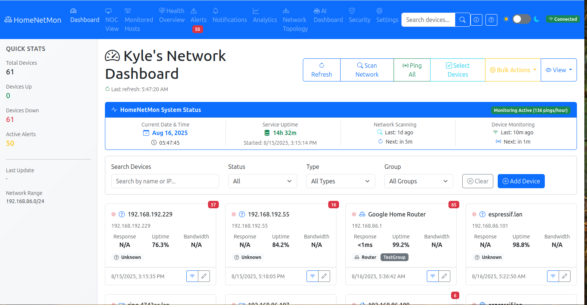
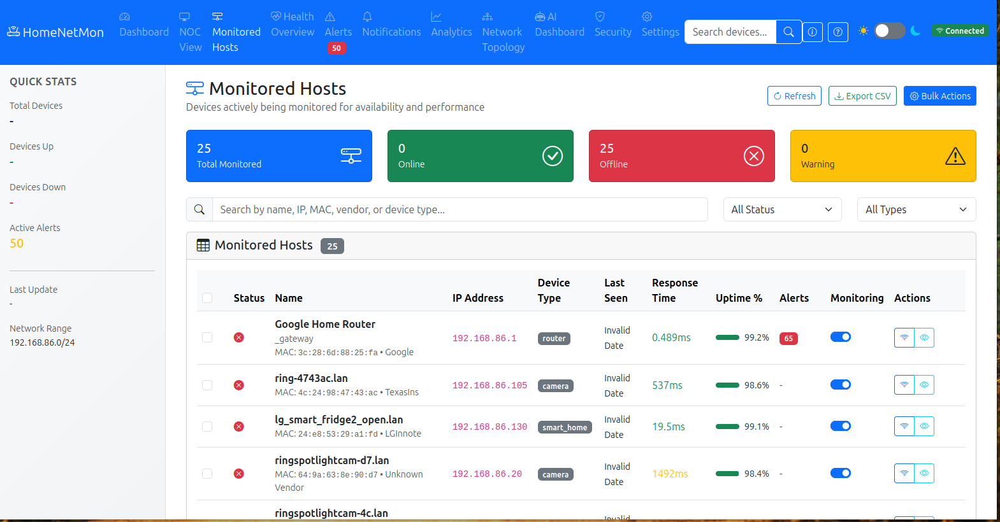
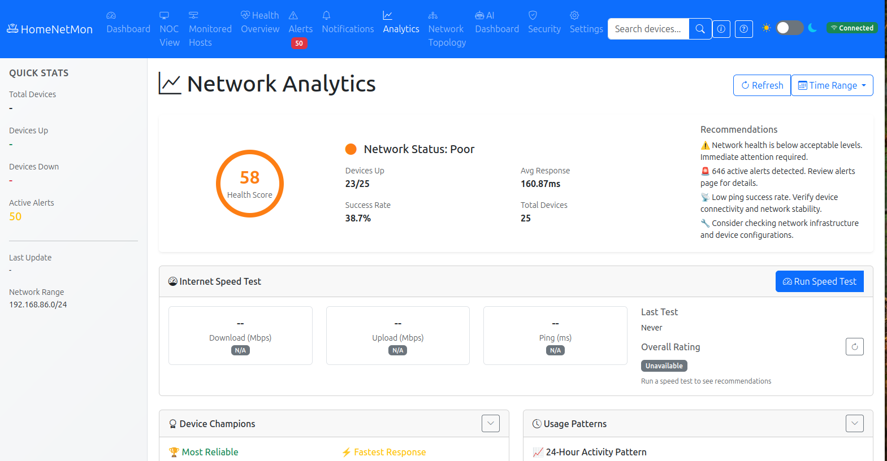
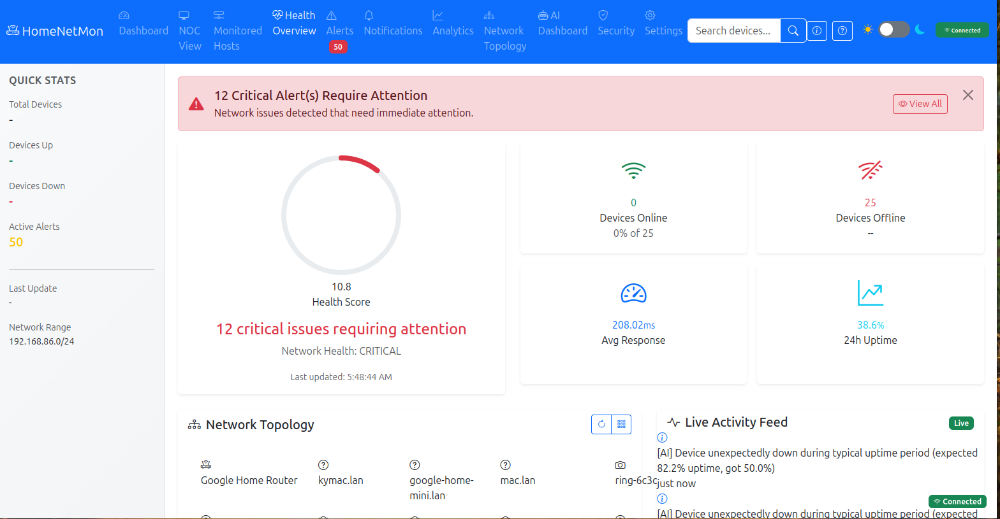
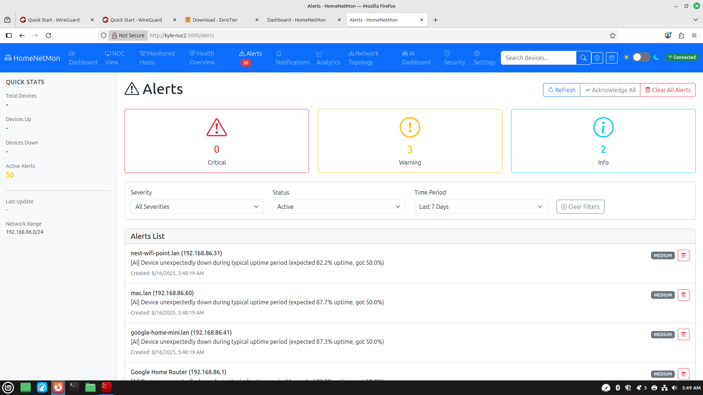

# HomeNetMon - Home Network Monitoring Solution

A comprehensive, self-hosted network monitoring solution designed for home networks. Monitor device availability, track performance metrics, receive alerts, and gain insights into your network's health through an intuitive web dashboard.

## Screenshots

### 🏠 Main Dashboard

*Real-time device monitoring with status grid and network overview*

### 📊 Monitored Hosts

*Comprehensive device management with MAC addresses, vendor information, and bulk operations*

### 📈 Analytics Dashboard  

*Network performance analytics, health scores, and usage insights*

### 🏥 Health Overview

*Network health monitoring with real-time metrics and performance trends*

### 🚨 Alert Management

*Active alert monitoring, notifications, and alert history management*

## Features

### 🔍 **Network Discovery & Device Management**
- Automatic device discovery using ARP table parsing and nmap scanning
- Device identification from mDNS services, DHCP hostnames and MAC vendor lookup (randomized MACs handled)
- Device type classification (router, computer, phone, camera, printer, smart home, …) with one-click re-classification
- Custom names, groups, tags and notes; an Add-device form for hosts discovery cannot see
- Persistent device information storage; devices that leave the configured range are archived, not pinged

### 📊 **Real-time Monitoring**
- Continuous ping monitoring with configurable intervals
- Internet and gateway reachability check with an outage alert
- Response time tracking, availability and p50 / p95 percentiles per device
- Device availability status (up/down/warning/unknown) from one shared definition
- Historical data collection with a single retention policy

### 🌐 **Web Dashboard**
- Modern, responsive web interface
- Real-time status updates via WebSockets
- Interactive device grid and list views
- Individual device detail pages with graphs
- Network topology visualization
- Mobile-friendly design

### 🔔 **Alerting System**
- Alert rules for device down / recovery, high latency, new devices, performance, security findings and internet loss
- Notification channels: ntfy push, email via SMTP, webhooks, Discord (each with a test button)
- Alert acknowledgement, resolution, bulk actions, server-side filters and quiet-hours suppression rules
- Automatic resolution when the condition clears

### ⚙️ **Configuration & Management**
- Web-based configuration with history and rollback
- Environment variables seed a fresh install; Settings values win afterwards
- Data retention policies
- Export capabilities (CSV)

## Security Model

**HomeNetMon has no authentication by design.** Anyone who can reach the dashboard on your LAN has full access to the UI and API. This is intentional — the app is meant for trusted home and small-business networks behind a router/firewall. **Do not expose it to the public internet.** If you need remote access, use Tailscale (works as-is, see [Deployment Guide](docs/DEPLOYMENT_GUIDE.md#tailscale)), a VPN, or a reverse proxy that authenticates (Authelia, basic auth in nginx). The repo has rate limiting, CSRF protection on state-changing endpoints, and input validation as defense in depth, but it is not designed to withstand an internet-facing attacker.

## Quick Start

### Manual Installation (Recommended for Development)

The fastest way to get HomeNetMon running:

1. **Install system dependencies:**
   ```bash
   # Ubuntu/Debian
   sudo apt update
   sudo apt install -y python3 python3-pip python3-venv nmap
   ```

2. **Clone and setup:**
   ```bash
   git clone https://github.com/ShaKy8/HomeNetMon.git
   cd HomeNetMon
   
   # Create virtual environment
   python3 -m venv venv
   source venv/bin/activate
   
   # Install dependencies
   pip install --upgrade pip
   pip install -r requirements.txt
   ```

3. **Configure:**
   ```bash
   cp .env.example .env
   # Edit NETWORK_RANGE in .env to match your network (e.g., 192.168.1.0/24)
   nano .env
   ```

4. **Start HomeNetMon:**
   ```bash
   python app.py
   ```

5. **Access dashboard:** http://localhost:5000

### Docker Deployment 

1. **Clone and start:**
   ```bash
   git clone https://github.com/ShaKy8/HomeNetMon.git
   cd HomeNetMon
   cp .env.example .env
   # Edit .env with your settings
   docker-compose up -d
   ```

2. **Access dashboard:** http://localhost:5000

### Production Installation (Ubuntu/Debian)

1. **Run the automated installer** (as your normal user; it uses sudo where needed). The service runs under gunicorn from `wsgi.py`:
   ```bash
   ./install.sh            # system service in /opt/homenetmon
   ./install.sh --user     # or: per-user service from this checkout, no root
   ```

2. **Access dashboard:** http://your-server-ip:5000

## Installation Methods

### Option 1: Docker (Recommended)

Docker provides the easiest deployment method with all dependencies included.

**Prerequisites:**
- Docker Engine 20.10+
- Docker Compose v2.0+

**Step-by-step:**

1. **Clone and prepare:**
   ```bash
   git clone <repository-url>
   cd HomeNetMon
   mkdir -p data config
   ```

2. **Configure environment variables:**
   ```bash
   cat > .env << EOF
   # Network Configuration
   NETWORK_RANGE=192.168.1.0/24
   PING_INTERVAL=600
   SCAN_INTERVAL=86400
   
   # Email Alerts (Optional)
   SMTP_SERVER=smtp.gmail.com
   SMTP_PORT=587
   SMTP_USERNAME=your-email@gmail.com
   SMTP_PASSWORD=your-app-password
   ALERT_FROM_EMAIL=your-email@gmail.com
   ALERT_TO_EMAILS=admin@yourdomain.com
   
   # Security
   SECRET_KEY=your-super-secret-key-here
   EOF
   ```

3. **Start services:**
   ```bash
   docker-compose up -d
   ```

4. **Verify installation:**
   ```bash
   curl http://localhost:5000/health
   ```

### Option 2: Native Installation

For Ubuntu/Debian systems, use the automated installation script.

**Prerequisites:**
- Ubuntu 18.04+ or Debian 10+
- Sudo privileges
- Internet connection

**Installation:**
```bash
# Make script executable
chmod +x install.sh

# Run installation (do not use sudo; the script asks for it where needed)
./install.sh

# Check service status
sudo systemctl status homenetmon
```

**Manual Installation:**

If you prefer manual installation or are using a different OS:

1. **Install system dependencies:**
   ```bash
   # Ubuntu/Debian
   sudo apt update
   sudo apt install -y python3 python3-pip python3-venv nmap iputils-ping net-tools
   
   # CentOS/RHEL  
   sudo yum install python3 python3-pip python3-venv nmap iputils net-tools
   
   # Arch Linux
   sudo pacman -S python python-pip nmap iputils net-tools
   ```

2. **Clone the repository:**
   ```bash
   git clone https://github.com/ShaKy8/HomeNetMon.git
   cd HomeNetMon
   ```

3. **Create and activate virtual environment:**
   ```bash
   python3 -m venv venv
   source venv/bin/activate
   ```

4. **Install Python dependencies:**
   ```bash
   pip install --upgrade pip
   pip install -r requirements.txt
   ```

5. **Create configuration file:**
   ```bash
   cp .env.example .env
   # Edit .env with your network settings
   nano .env
   ```
   Update at minimum:
   - `NETWORK_RANGE=192.168.1.0/24` (change to match your network)
   - `DEBUG=true` (for development)

6. **Start HomeNetMon:**
   ```bash
   python app.py
   ```

7. **Access the dashboard:**
   Open http://localhost:5000 in your browser

**To stop HomeNetMon:**
```bash
# Find the process ID
ps aux | grep "python app.py"
# Kill the process
pkill -f "python app.py"
```

## Configuration

### Environment Variables

| Variable | Default | Description |
|----------|---------|-------------|
| `NETWORK_RANGE` | `192.168.86.0/24` | Network range to monitor (CIDR notation); addresses outside it are ignored |
| `PING_INTERVAL` | `600` | Seconds between ping cycles (deliberately gentle on IoT devices) |
| `SCAN_INTERVAL` | `86400` | Seconds between discovery scans (daily) |
| `PING_TIMEOUT` | `3.0` | Ping timeout in seconds |
| `MAX_WORKERS` | `50` | Maximum concurrent monitoring threads |
| `HOST` | `127.0.0.1` | Web server bind address; the systemd units and Docker set `0.0.0.0` for LAN access |
| `PORT` | `5000` | Web server port |
| `DEBUG` | `false` | Enable debug mode |
| `DATA_RETENTION_DAYS` | `30` | Days of history to keep (applies to every time-series table) |
| `STALE_DEVICE_DAYS` | `30` | Devices unseen this long stop being pinged until seen again |
| `BASE_URL` | auto | Public URL used in notification links |
| `SECURITY_SCANNING_ENABLED` | `false` | nmap port scans of devices (can destabilise IoT) |

> Values saved in **Settings** override `NETWORK_RANGE`, `PING_INTERVAL`, `SCAN_INTERVAL` and `BANDWIDTH_INTERVAL`; the environment only seeds them on a fresh database.

### Email Configuration

| Variable | Description |
|----------|-------------|
| `SMTP_SERVER` | SMTP server hostname |
| `SMTP_PORT` | SMTP server port (usually 587) |
| `SMTP_USERNAME` | SMTP authentication username |
| `SMTP_PASSWORD` | SMTP authentication password |
| `SMTP_USE_TLS` | Enable TLS encryption (true/false) |
| `ALERT_FROM_EMAIL` | From address for alert emails |
| `ALERT_TO_EMAILS` | Comma-separated recipient addresses |

### Webhook Configuration

| Variable | Description |
|----------|-------------|
| `WEBHOOK_URL` | URL to POST alert notifications |
| `WEBHOOK_TIMEOUT` | Webhook request timeout in seconds |

### Runtime settings

Network range, intervals, alert thresholds and notification channels can be changed at any time under **Settings** in the dashboard; those values are stored in the database and take precedence over the environment.

## Usage Guide

### Initial Setup

1. **Access the dashboard** at `http://your-server:5000`
2. **Configure network range** in Settings → Network
3. **Set up alerts** in Settings → Alerts
4. **Wait for initial scan** to discover devices (may take a few minutes)

### Managing Devices

**Add Device Manually:**
- Click "Add Device" on dashboard
- Enter IP address and optional details
- Choose whether to monitor the device

**Edit Device:**
- Click device card or use edit button
- Modify name, type, group, or monitoring status
- Save changes

**Device Groups:**
- Organize devices into logical groups
- Filter dashboard by group
- Useful for different network segments

### Monitoring Features

**Dashboard Views:**
- **Grid View:** Visual cards showing device status
- **List View:** Tabular view with detailed information
- **Filters:** Search by name, IP, status, type, or group

**Device Details:**
- Response time charts (1H, 6H, 24H, 7D)
- Uptime statistics
- Historical monitoring data
- Recent alerts

**Real-time Updates:**
- Status changes appear immediately
- Live response time monitoring
- Automatic refresh every 30 seconds

### Alert Management

**Alert Types:**
- **Device Down:** Device doesn't respond to ping
- **High Latency:** Response time exceeds threshold
- **Custom:** Additional alerts can be configured

**Alert Actions:**
- **Acknowledge:** Mark alert as seen
- **Resolve:** Mark alert as fixed
- **Auto-resolve:** Alerts resolve when conditions improve

## API Documentation

HomeNetMon provides a REST API for integration with other systems.

### Authentication

There is no authentication: HomeNetMon is designed for a trusted home LAN. Keep it off the public internet (firewall or VPN). State-changing requests (POST/PUT/DELETE) must carry the `X-CSRF-Token` header obtained from `GET /api/csrf-token`. Interactive docs: `/api/docs`.

### Endpoints

#### Devices

**Get All Devices**
```http
GET /api/devices
```

**Get Specific Device**
```http
GET /api/devices/{id}
```

**Create Device**
```http
POST /api/devices
Content-Type: application/json

{
  "ip_address": "192.168.1.100",
  "custom_name": "My Device",
  "device_type": "computer",
  "device_group": "main",
  "is_monitored": true
}
```

**Update Device**
```http
PUT /api/devices/{id}
Content-Type: application/json

{
  "custom_name": "Updated Name",
  "is_monitored": false
}
```

**Delete Device**
```http
DELETE /api/devices/{id}
```

**Ping Device**
```http
POST /api/devices/{id}/ping
```

#### Monitoring Data

**Get Monitoring Timeline**
```http
GET /api/monitoring/timeline?device_id=1&hours=24&interval=hour
```

**Get Statistics**
```http
GET /api/monitoring/statistics?device_id=1&hours=24
```

**Export Data**
```http
GET /api/monitoring/export?device_id=1&hours=168
```

#### Alerts

**Get Alerts**
```http
GET /api/monitoring/alerts?severity=critical&resolved=false
```

**Acknowledge Alert**
```http
POST /api/monitoring/alerts/{id}/acknowledge
```

**Resolve Alert**
```http
POST /api/monitoring/alerts/{id}/resolve
```

#### Configuration

**Get Configuration**
```http
GET /api/config
```

**Update Network Config**
```http
PUT /api/config/network
Content-Type: application/json

{
  "network_range": "192.168.1.0/24",
  "ping_interval": 600,
  "scan_interval": 86400
}
```

The full, generated route list is in [docs/API_REFERENCE.md](docs/API_REFERENCE.md); interactive docs at `/api/docs`.

## Troubleshooting

### Common Issues

**1. Installation Issues**

*Problem: "ModuleNotFoundError: No module named 'pip'"*
```bash
# Solution: Install pip for your system
sudo apt install python3-pip python3-venv  # Ubuntu/Debian
```

*Problem: "externally-managed-environment" error*
```bash
# This is expected on newer Python versions
# Solution: Always use virtual environments (already in our instructions)
python3 -m venv venv
source venv/bin/activate
pip install -r requirements.txt
```

*Problem: "ModuleNotFoundError: No module named 'numpy'"*
```bash
# Solution: The requirements.txt now includes all needed packages
# Make sure you're in the virtual environment and run:
pip install -r requirements.txt
```

**2. Network Discovery Issues**

*Problem: No devices discovered*
- Check network range configuration in `.env`: `NETWORK_RANGE=192.168.1.0/24`
- Verify HomeNetMon can access the network
- Ensure nmap is installed: `which nmap`
- Check firewall settings
- Try manual nmap scan: `nmap -sn 192.168.1.0/24`

*Problem: nmap errors in logs*
- Verify nmap installation: `nmap --version`
- Check network permissions
- Try running as sudo for testing: `sudo python app.py`

**3. Permission Issues**

*Problem: Permission errors for ping operations*
- On Debian/Ubuntu `ping` and `nmap` carry `cap_net_raw`, so no privileges are needed; check with `getcap $(which ping)`
- Otherwise grant it once: `sudo setcap cap_net_raw+ep $(which ping)`

**4. Application Startup Issues**

*Problem: "Address already in use" error*
```bash
# Solution: Kill existing process or change port
pkill -f "python app.py"
# Or change PORT in .env file
```

*Problem: Web interface not accessible*
- Check if service is running: `ps aux | grep "python app.py"`
- Verify port setting in `.env`: `PORT=5000`
- Check firewall: `sudo ufw allow 5000`
- Try accessing via `http://localhost:5000`

**5. Performance Issues**

*Problem: High CPU usage*
- Reduce monitoring frequency in Settings (the default ping cycle is already 10 minutes)
- Decrease max_workers: `MAX_WORKERS=25`
- Check for network connectivity issues

*Problem: Memory usage growing*
- Check data retention settings: `DATA_RETENTION_DAYS=7`
- Verify database cleanup is working
- Restart the service periodically

**6. Alert Issues**

*Problem: Email alerts not working*
- Test email/webhook configuration in `.env`
- Check SMTP credentials and server settings
- Verify network connectivity to SMTP server
- Review alert thresholds in web interface

### Log Files

**Manual Installation (Development):**
```bash
# View logs in real-time
tail -f homenetmon.log

# View recent logs
tail -50 homenetmon.log

# Check application status
ps aux | grep "python app.py"
```

**Docker Installation:**
```bash
docker compose logs -f homeNetMon
```

**Systemd Service Installation:**
```bash
# View service logs
sudo journalctl -u homenetmon -f

# Check service status
sudo systemctl status homenetmon

# View log file
tail -f /opt/homenetmon/logs/homenetmon.log
```

**Log Analysis Tips:**
- Look for `ERROR` entries for critical issues
- `WARNING` entries may indicate configuration problems
- `INFO` entries show normal operation
- Device discovery logs show: "Found X devices with nmap scan"
- Monitoring logs show: "Monitoring cycle completed for X devices"

### Performance Tuning

Intervals live in **Settings → Network** (they override the environment). For large networks raise
`ping_interval`, lower `max_workers` and shorten `DATA_RETENTION_DAYS`; for tiny networks a shorter
`ping_interval` is fine. The defaults (600 s ping, daily scan) are deliberately gentle on IoT devices.

### Database Maintenance

**Backup Database:**
```bash
# Docker
docker exec homeNetMon sqlite3 /app/data/homeNetMon.db ".backup /app/data/backup.db"

# Native
venv/bin/python scripts/backup_database.py   # online, WAL-safe backup into backups/
```

**Restore Database:**
```bash
# Stop service first
sudo systemctl stop homenetmon

# Restore
cp backups/homeNetMon_full_<timestamp>.db production_data/homeNetMon.db   # /opt/homenetmon/data/ for the system install

# Restart service
sudo systemctl start homenetmon
```

## Security Considerations

### Network Security
- Run on isolated network segment if possible
- Use firewall to restrict access
- Consider VPN access for remote monitoring

### Application Security
- Change default secret key
- Use strong passwords for email accounts
- Regularly update dependencies
- Monitor access logs

### Container Security
- Keep Docker images updated
- Use non-root user (already configured)
- Limit container capabilities
- Regular security scans

## Development

### Development Setup

1. **Clone repository:**
   ```bash
   git clone <repository-url>
   cd HomeNetMon
   ```

2. **Create virtual environment:**
   ```bash
   python3 -m venv venv
   source venv/bin/activate
   ```

3. **Install dependencies:**
   ```bash
   pip install -r requirements.txt
   ```

4. **Run development server:**
   ```bash
   export DEBUG=true
   export NETWORK_RANGE="192.168.1.0/24"
   python app.py
   ```

### Project Structure

```
HomeNetMon/
├── app.py                 # create_app(): middleware, blueprints, singleton services, threads
├── wsgi.py                # gunicorn entry point (production)
├── config.py / constants.py / models.py / version.py
├── monitoring/            # scanner (discovery + identification), monitor (pings), alerts,
│                          # bandwidth_monitor, wan_monitor, device_classifier, mdns, ping
├── services/              # security_scanner, performance_monitor, retention, device_counts,
│                          # configuration_service, rate_limiter, notifications, health_score, …
├── api/                   # REST blueprints (devices, monitoring, analytics, config, security, …)
├── core/                  # CSRF/security headers, error handler, thread-heartbeat watchdog, validators
├── templates/ + static/   # Jinja + Bootstrap 5 + Chart.js + vanilla JS (no build step)
├── scripts/               # operational one-shots (backup, maintenance window, schema cleanup)
├── tests/                 # unit + integration (pytest), TestHomeNetmon.js (Playwright)
├── systemd/, Dockerfile, docker-compose.yml, install.sh
└── docs/                  # deployment, operations, security, troubleshooting, user and API guides
```

### Contributing

1. Fork the repository
2. Create feature branch (`git checkout -b feature/amazing-feature`)
3. Commit changes (`git commit -m 'Add amazing feature'`)
4. Push to branch (`git push origin feature/amazing-feature`)
5. Open Pull Request

### Testing

```bash
pip install -r requirements-dev.txt
pytest tests/unit tests/integration          # what CI runs (with --cov-fail-under=47)
pytest tests/unit/test_alerts_api.py -q      # one file
ruff check .
BASE_URL=http://127.0.0.1:5001 npx playwright test   # browser suite against a dev instance, never production
```

## FAQ

**Q: Can HomeNetMon monitor devices on different subnets?**
A: One `NETWORK_RANGE` per instance. Devices outside it are archived (kept, not pinged) and come back automatically if you widen the range in Settings.

**Q: How accurate is the device type detection?**
A: It combines mDNS service types, DHCP/DNS hostnames and MAC vendor lookup (skipped for randomized MACs). Devices that expose none of those stay *unknown*; set the type by hand on the device page and it is never overwritten. "Reclassify unknown" on the dashboard re-runs detection.

**Q: Can I monitor devices outside my network?**
A: Only the internet reachability check (gateway plus one external target, see Settings → Network). For monitoring remote hosts use a dedicated uptime service.

**Q: What happens if HomeNetMon goes down?**
A: Monitoring stops, but no data is lost. Historical data remains in the database, and monitoring resumes when the service restarts.

**Q: Can I integrate HomeNetMon with Home Assistant?**
A: Yes, you can use the REST API or webhook notifications to integrate with Home Assistant or other home automation systems.

**Q: Is there a mobile app?**
A: Currently, there's only the web interface, which is mobile-responsive. A dedicated mobile app is not available.

## License

This project is licensed under the MIT License - see the [LICENSE](LICENSE) file for details.

## Support

- **Issues:** Report bugs and request features via GitHub Issues
- **Documentation:** Check this README and inline code comments
- **Community:** Join discussions in GitHub Discussions

## Acknowledgments

- Built with Flask, SQLAlchemy, and Bootstrap
- Network scanning powered by nmap
- Charts provided by Chart.js
- Real-time updates via Socket.IO

---

**HomeNetMon** - Keep your home network running smoothly! 🏠📡
